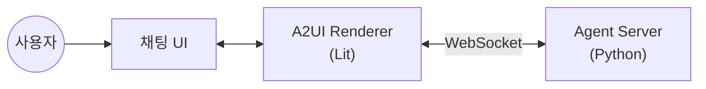

# A2UI 여행 예약 봇

A2UI 프로토콜을 활용한 동적 UI 생성 챗봇 PoC

## 개요



## 기술 스택

| 구성요소 | 기술 |
|----------|------|
| **Frontend** | React + Vite + TypeScript |
| **A2UI Renderer** | @a2ui/lit (Web Components) |
| **Agent Server** | Python + FastAPI + WebSocket |
| **LLM** | Google Gemini |

## 주요 기능

- **동적 폼 생성**: 여행 타입별 다른 예약 폼 렌더링
- **조건부 UI**: 사용자 선택에 따른 필드 표시/숨김
- **실시간 바인딩**: 폼 입력값 양방향 데이터 바인딩
- **다양한 입력**: 날짜, 선택, 체크박스, 스테퍼 등

## 지원 예약 타입

| 타입 | 설명 |
|------|------|
| 항공권 | 출발지, 도착지, 날짜, 인원, 좌석등급 |
| 호텔 | 목적지, 체크인/아웃, 객실, 옵션 |
| 렌터카 | 픽업/반납, 차종, 보험/옵션 |
| 패키지 | 항공+호텔+렌터카 조합 |

## 빠른 시작

### Frontend

```bash
cd frontend
npm install
npm run dev
# http://localhost:5173
```

### Agent Server

```bash
cd agent
uv venv && source .venv/bin/activate
uv pip install -e .
export GEMINI_API_KEY="your-api-key"
uvicorn src.main:app --reload --port 8000
```

## 프로젝트 구조

```
travel-booking-bot/
├── frontend/          # React 프론트엔드
├── agent/             # Python Agent 서버
├── docs/
│   ├── SPEC.md        # 상세 설계 스펙
│   ├── A2UI-MESSAGES.md  # A2UI 메시지 스펙
│   └── USER-FLOWS.md  # 사용자 시나리오
└── README.md          # 이 문서
```

## 문서

- [상세 설계 스펙](./docs/SPEC.md)
- [A2UI 메시지 스펙](./docs/A2UI-MESSAGES.md)
- [사용자 플로우](./docs/USER-FLOWS.md)

## 환경 변수

### frontend/.env

```env
VITE_WS_URL=ws://localhost:8000/ws/chat
```

### agent/.env

```env
GEMINI_API_KEY=your-gemini-api-key
```

## 라이선스

MIT
