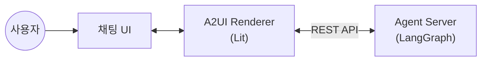

# A2UI 여행 예약 봇

A2UI 프로토콜을 활용한 동적 UI 생성 챗봇 PoC

## 개요



## 기술 스택

| 구성요소 | 기술 |
|----------|------|
| **Frontend** | React + Vite + TypeScript |
| **A2UI Renderer** | @a2ui/lit (Web Components) |
| **Agent Server** | Python + FastAPI + LangGraph |
| **LLM** | OpenAI GPT (gpt-4o-mini 기본) |

## 주요 기능

### 동적 UI
- **동적 폼 생성**: 여행 타입별 다른 예약 폼 렌더링
- **조건부 UI**: 사용자 선택에 따른 필드 표시/숨김
- **실시간 바인딩**: 폼 입력값 양방향 데이터 바인딩
- **다양한 입력**: 날짜, 선택, 체크박스, 스테퍼 등

### 채팅 기반 폼 수정
- **자연어 수정**: "출발일을 내일로 바꿔줘" → 폼 데이터 자동 업데이트
- **명확화 질문**: 모호한 요청 시 ("내일로 바꿔줘") → "출발일과 귀국일 중 어떤 날짜를 변경할까요?"
- **대화 맥락 유지**: 이전 대화 기반 의도 파악

### UX 개선
- **에러 처리**: 네트워크 오류 시 사용자 피드백
- **응답 중단**: LLM 응답 대기 중 중단 버튼으로 취소 가능
- **로딩 상태**: 응답 대기 중 애니메이션 표시

## 지원 예약 타입

| 타입 | 설명 |
|------|------|
| 항공권 | 출발지, 도착지, 날짜, 인원, 좌석등급 |
| 호텔 | 목적지, 체크인/아웃, 객실, 옵션 |
| 렌터카 | 픽업/반납, 차종, 보험/옵션 |

## 빠른 시작

### Frontend

```bash
cd frontend
npm install
npm run dev
# http://localhost:5173
```

### Agent Server

```bash
cd agent
uv venv && source .venv/bin/activate
uv pip install -e .
uvicorn src.main:app --reload --port 8003
```

## 프로젝트 구조

```
travel-booking-bot/
├── frontend/          # React 프론트엔드
│   └── src/
│       ├── components/
│       │   ├── Chat/      # 채팅 UI
│       │   └── A2UI/      # A2UI 렌더러
│       ├── hooks/         # React 훅 (useChat, useA2UI)
│       └── services/      # API 서비스
├── agent/             # Python Agent 서버
│   └── src/
│       ├── graph/         # LangGraph 그래프 정의
│       ├── nodes/         # 그래프 노드 (intent, form, modify 등)
│       └── forms/         # 폼 생성기
├── docs/
│   ├── SPEC.md            # 상세 설계 스펙
│   ├── A2UI-MESSAGES.md   # A2UI 메시지 스펙
│   └── USER-FLOWS.md      # 사용자 시나리오
└── README.md              # 이 문서
```

## 환경 변수

### frontend/.env

```env
VITE_API_URL=http://localhost:8003
```

### agent/.env

```env
# OpenAI (기본)
OPENAI_API_KEY=your-openai-api-key
LLM_MODEL=gpt-4o-mini

# 또는 Google Gemini
# GEMINI_API_KEY=your-gemini-api-key
# LLM_MODEL=gemini-2.0-flash
```

## 라이선스

MIT
