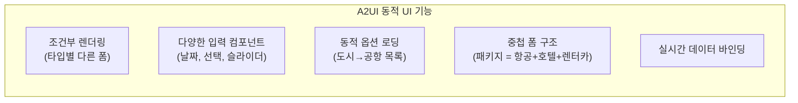
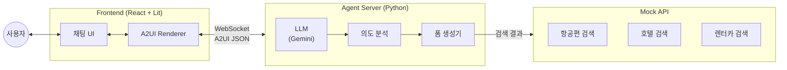
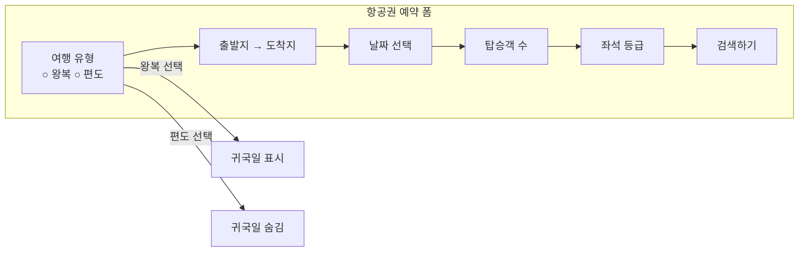
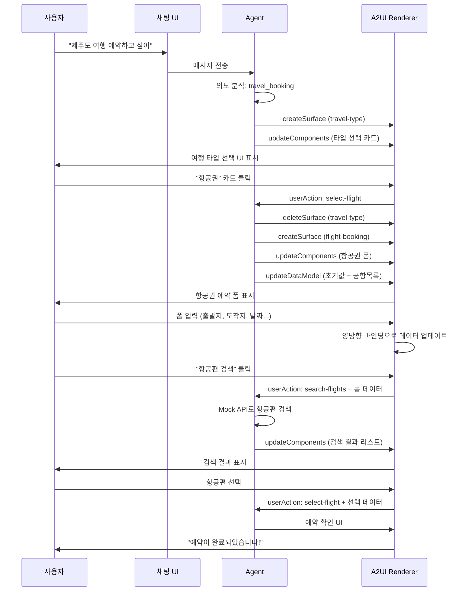
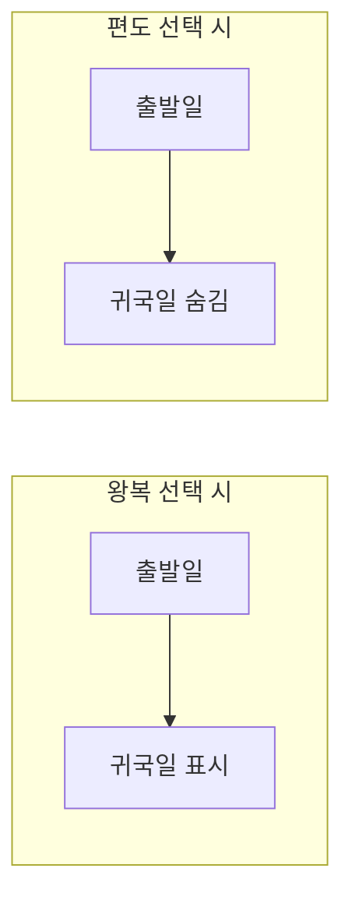

# A2UI 여행 예약 봇 미니 프로젝트

> **목표**: A2UI를 활용하여 동적 여행 예약 폼을 생성하는 챗봇 PoC
> **스택**: React + Lit(A2UI) + Python Agent
> **핵심**: 조건부 UI, 다양한 입력 타입, 동적 옵션 로딩

---

## 1. 프로젝트 개요

### 테스트할 A2UI 기능



### 지원 예약 타입

| 타입 | 주요 필드 | 난이도 |
|------|-----------|--------|
| **항공권** | 출발지, 도착지, 날짜, 인원, 좌석등급 | 중 |
| **호텔** | 도시, 체크인/아웃, 객실, 인원 | 중 |
| **렌터카** | 픽업장소, 날짜, 차종, 옵션 | 중 |
| **패키지** | 위 모든 것 조합 | 상 |

---

## 2. 아키텍처



---

## 3. 프로젝트 구조

```
travel-booking-bot/
├── frontend/                      # React 프론트엔드
│   ├── src/
│   │   ├── components/
│   │   │   ├── Chat/
│   │   │   │   ├── ChatContainer.tsx
│   │   │   │   ├── ChatInput.tsx
│   │   │   │   └── MessageList.tsx
│   │   │   └── A2UI/
│   │   │       ├── A2UIRenderer.tsx
│   │   │       └── LitWrapper.tsx
│   │   ├── hooks/
│   │   │   ├── useA2UI.ts
│   │   │   ├── useChat.ts
│   │   │   └── useWebSocket.ts
│   │   ├── services/
│   │   │   └── websocket.ts
│   │   ├── types/
│   │   │   └── a2ui.d.ts
│   │   ├── App.tsx
│   │   └── main.tsx
│   ├── package.json
│   ├── tsconfig.json
│   └── vite.config.ts
│
├── agent/                         # Python Agent 서버
│   ├── src/
│   │   ├── main.py               # FastAPI 엔트리
│   │   ├── agent.py              # LLM 에이전트
│   │   ├── intent.py             # 의도 분석
│   │   ├── forms/
│   │   │   ├── __init__.py
│   │   │   ├── base.py           # 기본 폼 생성기
│   │   │   ├── flight.py         # 항공권 폼
│   │   │   ├── hotel.py          # 호텔 폼
│   │   │   ├── car.py            # 렌터카 폼
│   │   │   └── package.py        # 패키지 폼
│   │   └── mock_data/
│   │       ├── airports.json     # 공항 목록
│   │       ├── cities.json       # 도시 목록
│   │       └── car_types.json    # 차종 목록
│   ├── pyproject.toml
│   └── .env.example
│
├── docs/
│   ├── a2ui-messages.md          # A2UI 메시지 스펙
│   └── user-flows.md             # 사용자 플로우
│
└── README.md
```

---

## 4. 핵심 A2UI 폼 설계

### 4.1 여행 타입 선택 (공통 진입점)

```json
{
  "createSurface": {
    "surfaceId": "travel-type-selector",
    "catalogId": "travel-booking"
  }
}
```

```json
{
  "updateComponents": {
    "surfaceId": "travel-type-selector",
    "components": [
      {
        "id": "root",
        "component": "Column",
        "children": ["header", "type-cards"]
      },
      {
        "id": "header",
        "component": "Text",
        "text": "어떤 여행을 계획하고 계신가요?",
        "style": "headline"
      },
      {
        "id": "type-cards",
        "component": "Row",
        "children": ["flight-card", "hotel-card", "car-card", "package-card"]
      },
      {
        "id": "flight-card",
        "component": "Card",
        "children": ["flight-icon", "flight-label"],
        "action": "select-flight"
      },
      {
        "id": "flight-icon",
        "component": "Icon",
        "icon": "airplane"
      },
      {
        "id": "flight-label",
        "component": "Text",
        "text": "항공권"
      },
      {
        "id": "hotel-card",
        "component": "Card",
        "children": ["hotel-icon", "hotel-label"],
        "action": "select-hotel"
      },
      {
        "id": "hotel-icon",
        "component": "Icon",
        "icon": "hotel"
      },
      {
        "id": "hotel-label",
        "component": "Text",
        "text": "호텔"
      },
      {
        "id": "car-card",
        "component": "Card",
        "children": ["car-icon", "car-label"],
        "action": "select-car"
      },
      {
        "id": "car-icon",
        "component": "Icon",
        "icon": "car"
      },
      {
        "id": "car-label",
        "component": "Text",
        "text": "렌터카"
      },
      {
        "id": "package-card",
        "component": "Card",
        "children": ["package-icon", "package-label"],
        "action": "select-package"
      },
      {
        "id": "package-icon",
        "component": "Icon",
        "icon": "package"
      },
      {
        "id": "package-label",
        "component": "Text",
        "text": "패키지"
      }
    ]
  }
}
```

---

### 4.2 항공권 예약 폼



```json
{
  "updateComponents": {
    "surfaceId": "flight-booking",
    "components": [
      {
        "id": "root",
        "component": "Column",
        "children": ["header", "trip-type", "route", "dates", "passengers", "class", "actions"]
      },
      {
        "id": "header",
        "component": "Text",
        "text": "항공권 검색",
        "style": "headline"
      },
      {
        "id": "trip-type",
        "component": "ChoicePicker",
        "label": "여행 유형",
        "mode": "single",
        "options": [
          {"value": "roundtrip", "label": "왕복"},
          {"value": "oneway", "label": "편도"}
        ],
        "binding": "/flight/tripType"
      },
      {
        "id": "route",
        "component": "Row",
        "children": ["departure", "swap-btn", "arrival"]
      },
      {
        "id": "departure",
        "component": "ChoicePicker",
        "label": "출발지",
        "options": "/airports",
        "binding": "/flight/departure",
        "searchable": true
      },
      {
        "id": "swap-btn",
        "component": "Button",
        "icon": "swap",
        "variant": "icon",
        "action": "swap-route"
      },
      {
        "id": "arrival",
        "component": "ChoicePicker",
        "label": "도착지",
        "options": "/airports",
        "binding": "/flight/arrival",
        "searchable": true
      },
      {
        "id": "dates",
        "component": "Row",
        "children": ["departure-date", "return-date"]
      },
      {
        "id": "departure-date",
        "component": "DateTimeInput",
        "label": "출발일",
        "mode": "date",
        "binding": "/flight/departureDate",
        "minDate": "today"
      },
      {
        "id": "return-date",
        "component": "DateTimeInput",
        "label": "귀국일",
        "mode": "date",
        "binding": "/flight/returnDate",
        "minDate": "/flight/departureDate",
        "visible": "/flight/tripType == 'roundtrip'"
      },
      {
        "id": "passengers",
        "component": "Row",
        "children": ["adults", "children", "infants"]
      },
      {
        "id": "adults",
        "component": "Stepper",
        "label": "성인",
        "min": 1,
        "max": 9,
        "binding": "/flight/passengers/adults"
      },
      {
        "id": "children",
        "component": "Stepper",
        "label": "아동 (2-11세)",
        "min": 0,
        "max": 9,
        "binding": "/flight/passengers/children"
      },
      {
        "id": "infants",
        "component": "Stepper",
        "label": "유아 (0-2세)",
        "min": 0,
        "max": 9,
        "binding": "/flight/passengers/infants"
      },
      {
        "id": "class",
        "component": "ChoicePicker",
        "label": "좌석 등급",
        "options": [
          {"value": "economy", "label": "이코노미"},
          {"value": "premium", "label": "프리미엄 이코노미"},
          {"value": "business", "label": "비즈니스"},
          {"value": "first", "label": "퍼스트"}
        ],
        "binding": "/flight/class"
      },
      {
        "id": "actions",
        "component": "Row",
        "children": ["back-btn", "search-btn"]
      },
      {
        "id": "back-btn",
        "component": "Button",
        "label": "이전",
        "variant": "outlined",
        "action": "back"
      },
      {
        "id": "search-btn",
        "component": "Button",
        "label": "항공편 검색",
        "variant": "filled",
        "action": "search-flights"
      }
    ]
  }
}
```

---

### 4.3 호텔 예약 폼

```json
{
  "updateComponents": {
    "surfaceId": "hotel-booking",
    "components": [
      {
        "id": "root",
        "component": "Column",
        "children": ["header", "destination", "dates", "rooms", "guests", "options", "actions"]
      },
      {
        "id": "header",
        "component": "Text",
        "text": "호텔 검색",
        "style": "headline"
      },
      {
        "id": "destination",
        "component": "TextField",
        "label": "목적지",
        "hint": "도시, 지역 또는 호텔명",
        "binding": "/hotel/destination",
        "icon": "search"
      },
      {
        "id": "dates",
        "component": "Row",
        "children": ["checkin", "checkout"]
      },
      {
        "id": "checkin",
        "component": "DateTimeInput",
        "label": "체크인",
        "mode": "date",
        "binding": "/hotel/checkinDate",
        "minDate": "today"
      },
      {
        "id": "checkout",
        "component": "DateTimeInput",
        "label": "체크아웃",
        "mode": "date",
        "binding": "/hotel/checkoutDate",
        "minDate": "/hotel/checkinDate"
      },
      {
        "id": "rooms",
        "component": "Stepper",
        "label": "객실 수",
        "min": 1,
        "max": 10,
        "binding": "/hotel/rooms"
      },
      {
        "id": "guests",
        "component": "Row",
        "children": ["adults", "children"]
      },
      {
        "id": "adults",
        "component": "Stepper",
        "label": "성인",
        "min": 1,
        "max": 10,
        "binding": "/hotel/guests/adults"
      },
      {
        "id": "children",
        "component": "Stepper",
        "label": "아동",
        "min": 0,
        "max": 10,
        "binding": "/hotel/guests/children"
      },
      {
        "id": "options",
        "component": "Column",
        "children": ["breakfast", "free-cancel", "pet-friendly"]
      },
      {
        "id": "breakfast",
        "component": "CheckBox",
        "label": "조식 포함",
        "binding": "/hotel/options/breakfast"
      },
      {
        "id": "free-cancel",
        "component": "CheckBox",
        "label": "무료 취소 가능",
        "binding": "/hotel/options/freeCancel"
      },
      {
        "id": "pet-friendly",
        "component": "CheckBox",
        "label": "반려동물 동반 가능",
        "binding": "/hotel/options/petFriendly"
      },
      {
        "id": "actions",
        "component": "Row",
        "children": ["back-btn", "search-btn"]
      },
      {
        "id": "back-btn",
        "component": "Button",
        "label": "이전",
        "variant": "outlined",
        "action": "back"
      },
      {
        "id": "search-btn",
        "component": "Button",
        "label": "호텔 검색",
        "variant": "filled",
        "action": "search-hotels"
      }
    ]
  }
}
```

---

### 4.4 렌터카 예약 폼

```json
{
  "updateComponents": {
    "surfaceId": "car-rental",
    "components": [
      {
        "id": "root",
        "component": "Column",
        "children": ["header", "same-location", "pickup", "dropoff", "dates", "car-type", "options", "actions"]
      },
      {
        "id": "header",
        "component": "Text",
        "text": "렌터카 검색",
        "style": "headline"
      },
      {
        "id": "same-location",
        "component": "CheckBox",
        "label": "동일 장소 반납",
        "binding": "/car/sameLocation"
      },
      {
        "id": "pickup",
        "component": "ChoicePicker",
        "label": "픽업 장소",
        "options": "/locations",
        "binding": "/car/pickupLocation",
        "searchable": true
      },
      {
        "id": "dropoff",
        "component": "ChoicePicker",
        "label": "반납 장소",
        "options": "/locations",
        "binding": "/car/dropoffLocation",
        "searchable": true,
        "visible": "/car/sameLocation == false"
      },
      {
        "id": "dates",
        "component": "Row",
        "children": ["pickup-datetime", "dropoff-datetime"]
      },
      {
        "id": "pickup-datetime",
        "component": "DateTimeInput",
        "label": "픽업 일시",
        "mode": "datetime",
        "binding": "/car/pickupDateTime",
        "minDate": "today"
      },
      {
        "id": "dropoff-datetime",
        "component": "DateTimeInput",
        "label": "반납 일시",
        "mode": "datetime",
        "binding": "/car/dropoffDateTime",
        "minDate": "/car/pickupDateTime"
      },
      {
        "id": "car-type",
        "component": "ChoicePicker",
        "label": "차종",
        "options": [
          {"value": "compact", "label": "소형"},
          {"value": "mid", "label": "중형"},
          {"value": "full", "label": "대형"},
          {"value": "suv", "label": "SUV"},
          {"value": "van", "label": "밴/미니밴"},
          {"value": "luxury", "label": "프리미엄"}
        ],
        "binding": "/car/type"
      },
      {
        "id": "options",
        "component": "Column",
        "children": ["insurance", "gps", "child-seat"]
      },
      {
        "id": "insurance",
        "component": "CheckBox",
        "label": "완전 자차 보험",
        "binding": "/car/options/insurance"
      },
      {
        "id": "gps",
        "component": "CheckBox",
        "label": "GPS 네비게이션",
        "binding": "/car/options/gps"
      },
      {
        "id": "child-seat",
        "component": "CheckBox",
        "label": "유아용 카시트",
        "binding": "/car/options/childSeat"
      },
      {
        "id": "actions",
        "component": "Row",
        "children": ["back-btn", "search-btn"]
      },
      {
        "id": "back-btn",
        "component": "Button",
        "label": "이전",
        "variant": "outlined",
        "action": "back"
      },
      {
        "id": "search-btn",
        "component": "Button",
        "label": "렌터카 검색",
        "variant": "filled",
        "action": "search-cars"
      }
    ]
  }
}
```

---

## 5. 사용자 플로우



---

## 6. 조건부 UI 처리

### 6.1 왕복/편도 전환



**A2UI에서 조건부 표시:**

```json
{
  "id": "return-date",
  "component": "DateTimeInput",
  "label": "귀국일",
  "binding": "/flight/returnDate",
  "visible": "/flight/tripType == 'roundtrip'"
}
```

### 6.2 동일 장소 반납 (렌터카)

```json
{
  "id": "dropoff",
  "component": "ChoicePicker",
  "label": "반납 장소",
  "binding": "/car/dropoffLocation",
  "visible": "/car/sameLocation == false"
}
```

---

## 7. 구현 단계

### Phase 1: 기본 셋업 (1일)

- [ ] 프로젝트 구조 생성
- [ ] React + Vite 초기화
- [ ] A2UI Lit 패키지 설치
- [ ] Python Agent 서버 셋업 (FastAPI + WebSocket)
- [ ] 기본 채팅 UI 구현

### Phase 2: A2UI 렌더링 (2일)

- [ ] Lit → React 래퍼 컴포넌트
- [ ] A2UI 메시지 파서 (useA2UI 훅)
- [ ] 여행 타입 선택 UI 구현
- [ ] 항공권 폼 구현 및 테스트

### Phase 3: 동적 기능 (2일)

- [ ] 조건부 필드 표시/숨김
- [ ] 동적 옵션 로딩 (공항 목록)
- [ ] 양방향 데이터 바인딩
- [ ] userAction 핸들링

### Phase 4: 추가 폼 (1-2일)

- [ ] 호텔 예약 폼
- [ ] 렌터카 예약 폼
- [ ] 검색 결과 리스트 UI

### Phase 5: 마무리 (1일)

- [ ] 에러 처리
- [ ] 로딩 상태
- [ ] 스타일링 개선
- [ ] 문서화

---

## 8. 실행 방법

### Frontend

```bash
cd frontend
npm install
npm run dev
# http://localhost:5173
```

### Agent Server

```bash
cd agent
uv venv
source .venv/bin/activate
uv pip install -e .
export GEMINI_API_KEY="your-api-key"
uvicorn src.main:app --reload --port 8000
```

---

## 9. 환경 변수

### frontend/.env

```env
VITE_WS_URL=ws://localhost:8000/ws/chat
```

### agent/.env

```env
GEMINI_API_KEY=your-gemini-api-key
```

---

## 10. 예상 결과 화면

### 여행 타입 선택

```
┌────────────────────────────────────────────────────┐
│  🤖 어떤 여행을 계획하고 계신가요?                  │
│                                                    │
│  ┌──────────┐ ┌──────────┐ ┌──────────┐ ┌────────┐│
│  │    ✈️    │ │    🏨    │ │    🚗    │ │   📦   ││
│  │  항공권  │ │   호텔   │ │  렌터카  │ │ 패키지 ││
│  └──────────┘ └──────────┘ └──────────┘ └────────┘│
└────────────────────────────────────────────────────┘
```

### 항공권 예약 폼

```
┌────────────────────────────────────────────────────┐
│  ✈️ 항공권 검색                                    │
│                                                    │
│  여행 유형                                         │
│  ● 왕복    ○ 편도                                  │
│                                                    │
│  출발지              도착지                        │
│  ┌────────────┐  ⇄  ┌────────────┐                │
│  │ 서울/인천 ▼│     │ 제주     ▼│                │
│  └────────────┘     └────────────┘                │
│                                                    │
│  출발일                귀국일                      │
│  ┌────────────┐      ┌────────────┐               │
│  │ 2025-01-15 │      │ 2025-01-18 │               │
│  └────────────┘      └────────────┘               │
│                                                    │
│  탑승객                                            │
│  성인      아동(2-11)   유아(0-2)                  │
│  [ 2 ]     [  0  ]      [  0  ]                   │
│                                                    │
│  좌석 등급                                         │
│  ┌──────────────────────┐                         │
│  │ 이코노미            ▼│                         │
│  └──────────────────────┘                         │
│                                                    │
│  ┌────────┐     ┌─────────────────┐               │
│  │  이전  │     │   항공편 검색   │               │
│  └────────┘     └─────────────────┘               │
└────────────────────────────────────────────────────┘
```

---

## 11. 성공 기준

| 항목 | 기준 |
|------|------|
| **타입 선택** | 4가지 여행 타입 카드가 렌더링되고 클릭 가능 |
| **조건부 UI** | 왕복/편도 전환 시 귀국일 필드 표시/숨김 |
| **데이터 바인딩** | 폼 입력값이 실시간으로 데이터 모델에 반영 |
| **폼 제출** | 검색 버튼 클릭 시 userAction 발생 및 데이터 전송 |
| **검색 결과** | Mock 데이터 기반 검색 결과 리스트 표시 |
