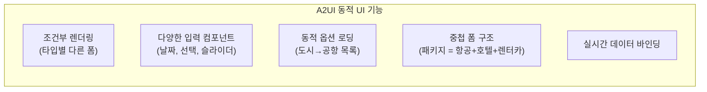
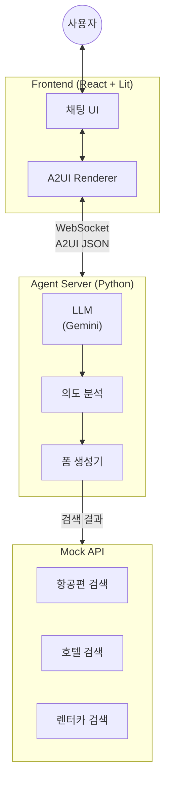
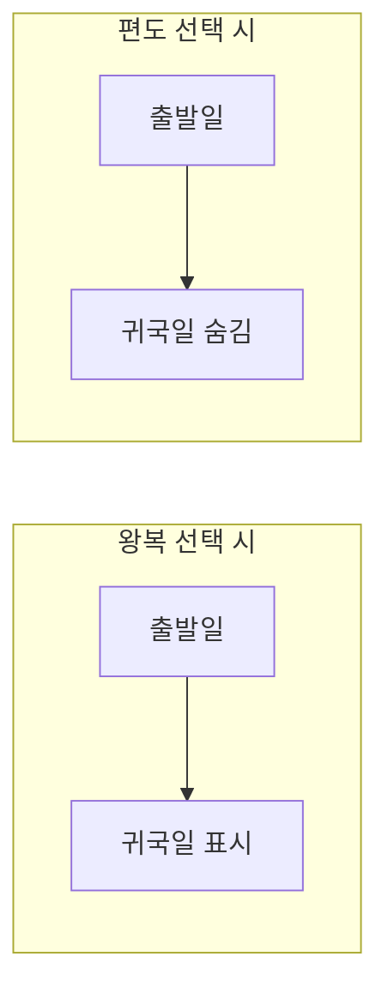

# A2UI 여행 예약 봇 - 상세 설계 스펙

> **버전**: 0.1.0
> **최종 수정**: 2025-01-01

---

## 1. 프로젝트 개요

### 1.1 목표

A2UI를 활용하여 동적 여행 예약 폼을 생성하는 챗봇 PoC

### 1.2 테스트할 A2UI 기능



### 1.3 지원 예약 타입

| 타입 | 주요 필드 | 난이도 |
|------|-----------|--------|
| **항공권** | 출발지, 도착지, 날짜, 인원, 좌석등급 | 중 |
| **호텔** | 도시, 체크인/아웃, 객실, 인원 | 중 |
| **렌터카** | 픽업장소, 날짜, 차종, 옵션 | 중 |
| **패키지** | 위 모든 것 조합 | 상 |

---

## 2. 아키텍처



---

## 3. 프로젝트 구조

```
travel-booking-bot/
├── frontend/                      # React 프론트엔드
│   ├── src/
│   │   ├── components/
│   │   │   ├── Chat/
│   │   │   │   ├── ChatContainer.tsx
│   │   │   │   ├── ChatInput.tsx
│   │   │   │   └── MessageList.tsx
│   │   │   └── A2UI/
│   │   │       ├── A2UIRenderer.tsx
│   │   │       └── LitWrapper.tsx
│   │   ├── hooks/
│   │   │   ├── useA2UI.ts
│   │   │   ├── useChat.ts
│   │   │   └── useWebSocket.ts
│   │   ├── services/
│   │   │   └── websocket.ts
│   │   ├── types/
│   │   │   └── a2ui.d.ts
│   │   ├── App.tsx
│   │   └── main.tsx
│   ├── package.json
│   ├── tsconfig.json
│   └── vite.config.ts
│
├── agent/                         # Python Agent 서버
│   ├── src/
│   │   ├── main.py               # FastAPI 엔트리
│   │   ├── agent.py              # LLM 에이전트
│   │   ├── intent.py             # 의도 분석
│   │   ├── forms/
│   │   │   ├── __init__.py
│   │   │   ├── base.py           # 기본 폼 생성기
│   │   │   ├── flight.py         # 항공권 폼
│   │   │   ├── hotel.py          # 호텔 폼
│   │   │   ├── car.py            # 렌터카 폼
│   │   │   └── package.py        # 패키지 폼
│   │   └── mock_data/
│   │       ├── airports.json     # 공항 목록
│   │       ├── cities.json       # 도시 목록
│   │       └── car_types.json    # 차종 목록
│   ├── pyproject.toml
│   └── .env.example
│
├── docs/
│   ├── SPEC.md                   # 상세 설계 (이 문서)
│   ├── A2UI-MESSAGES.md          # A2UI 메시지 스펙
│   └── USER-FLOWS.md             # 사용자 플로우
│
└── README.md
```

---

## 4. 조건부 UI 처리

### 4.1 왕복/편도 전환



**A2UI에서 조건부 표시:**

```json
{
  "id": "return-date",
  "component": "DateTimeInput",
  "label": "귀국일",
  "binding": "/flight/returnDate",
  "visible": "/flight/tripType == 'roundtrip'"
}
```

### 4.2 동일 장소 반납 (렌터카)

```json
{
  "id": "dropoff",
  "component": "ChoicePicker",
  "label": "반납 장소",
  "binding": "/car/dropoffLocation",
  "visible": "/car/sameLocation == false"
}
```

---

## 5. 구현 단계

### Phase 1: 기본 셋업 (1일)

- [ ] 프로젝트 구조 생성
- [ ] React + Vite 초기화
- [ ] A2UI Lit 패키지 설치
- [ ] Python Agent 서버 셋업 (FastAPI + WebSocket)
- [ ] 기본 채팅 UI 구현

### Phase 2: A2UI 렌더링 (2일)

- [ ] Lit → React 래퍼 컴포넌트
- [ ] A2UI 메시지 파서 (useA2UI 훅)
- [ ] 여행 타입 선택 UI 구현
- [ ] 항공권 폼 구현 및 테스트

### Phase 3: 동적 기능 (2일)

- [ ] 조건부 필드 표시/숨김
- [ ] 동적 옵션 로딩 (공항 목록)
- [ ] 양방향 데이터 바인딩
- [ ] userAction 핸들링

### Phase 4: 추가 폼 (1-2일)

- [ ] 호텔 예약 폼
- [ ] 렌터카 예약 폼
- [ ] 검색 결과 리스트 UI

### Phase 5: 마무리 (1일)

- [ ] 에러 처리
- [ ] 로딩 상태
- [ ] 스타일링 개선
- [ ] 문서화

---

## 6. 환경 변수

### frontend/.env

```env
VITE_WS_URL=ws://localhost:8000/ws/chat
```

### agent/.env

```env
GEMINI_API_KEY=your-gemini-api-key
```

---

## 7. 예상 결과 화면

### 여행 타입 선택

```
┌────────────────────────────────────────────────────┐
│  🤖 어떤 여행을 계획하고 계신가요?                  │
│                                                    │
│  ┌──────────┐ ┌──────────┐ ┌──────────┐ ┌────────┐│
│  │    ✈️    │ │    🏨    │ │    🚗    │ │   📦   ││
│  │  항공권  │ │   호텔   │ │  렌터카  │ │ 패키지 ││
│  └──────────┘ └──────────┘ └──────────┘ └────────┘│
└────────────────────────────────────────────────────┘
```

### 항공권 예약 폼

```
┌────────────────────────────────────────────────────┐
│  ✈️ 항공권 검색                                    │
│                                                    │
│  여행 유형                                         │
│  ● 왕복    ○ 편도                                  │
│                                                    │
│  출발지              도착지                        │
│  ┌────────────┐  ⇄  ┌────────────┐                │
│  │ 서울/인천 ▼│     │ 제주     ▼│                │
│  └────────────┘     └────────────┘                │
│                                                    │
│  출발일                귀국일                      │
│  ┌────────────┐      ┌────────────┐               │
│  │ 2025-01-15 │      │ 2025-01-18 │               │
│  └────────────┘      └────────────┘               │
│                                                    │
│  탑승객                                            │
│  성인      아동(2-11)   유아(0-2)                  │
│  [ 2 ]     [  0  ]      [  0  ]                   │
│                                                    │
│  좌석 등급                                         │
│  ┌──────────────────────┐                         │
│  │ 이코노미            ▼│                         │
│  └──────────────────────┘                         │
│                                                    │
│  ┌────────┐     ┌─────────────────┐               │
│  │  이전  │     │   항공편 검색   │               │
│  └────────┘     └─────────────────┘               │
└────────────────────────────────────────────────────┘
```

---

## 8. 성공 기준

| 항목 | 기준 |
|------|------|
| **타입 선택** | 4가지 여행 타입 카드가 렌더링되고 클릭 가능 |
| **조건부 UI** | 왕복/편도 전환 시 귀국일 필드 표시/숨김 |
| **데이터 바인딩** | 폼 입력값이 실시간으로 데이터 모델에 반영 |
| **폼 제출** | 검색 버튼 클릭 시 userAction 발생 및 데이터 전송 |
| **검색 결과** | Mock 데이터 기반 검색 결과 리스트 표시 |
