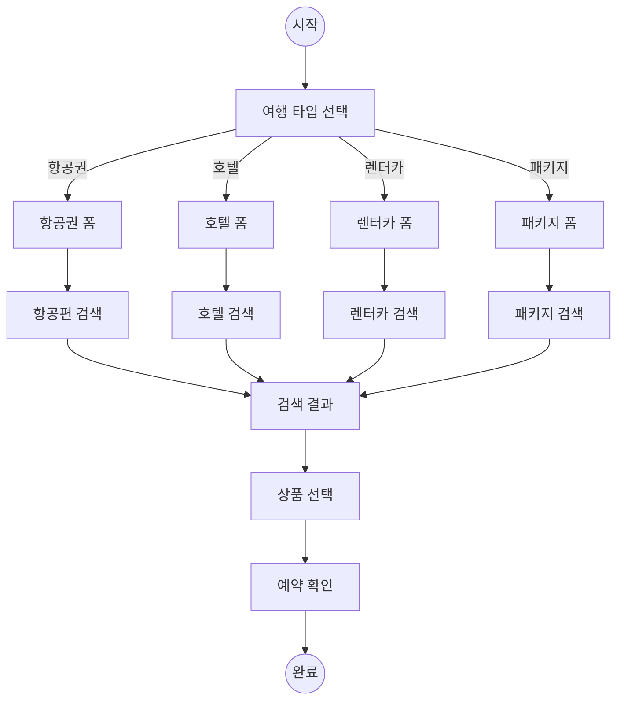
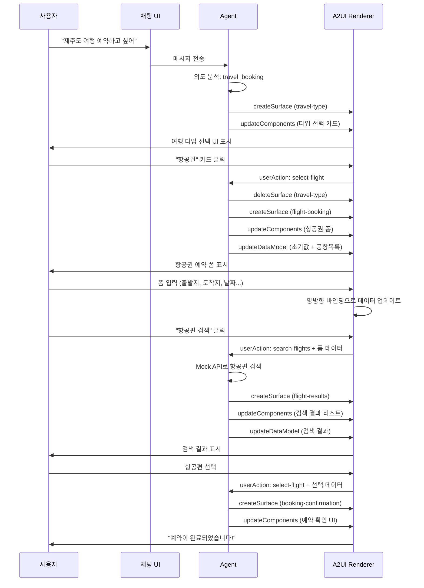
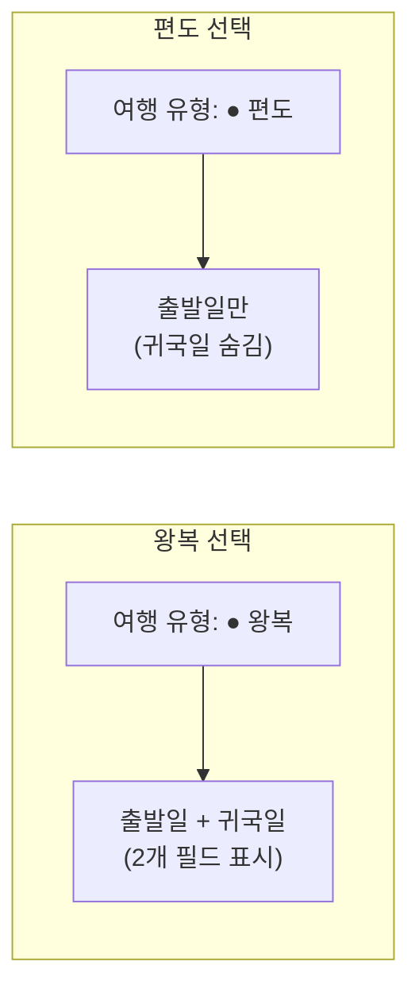
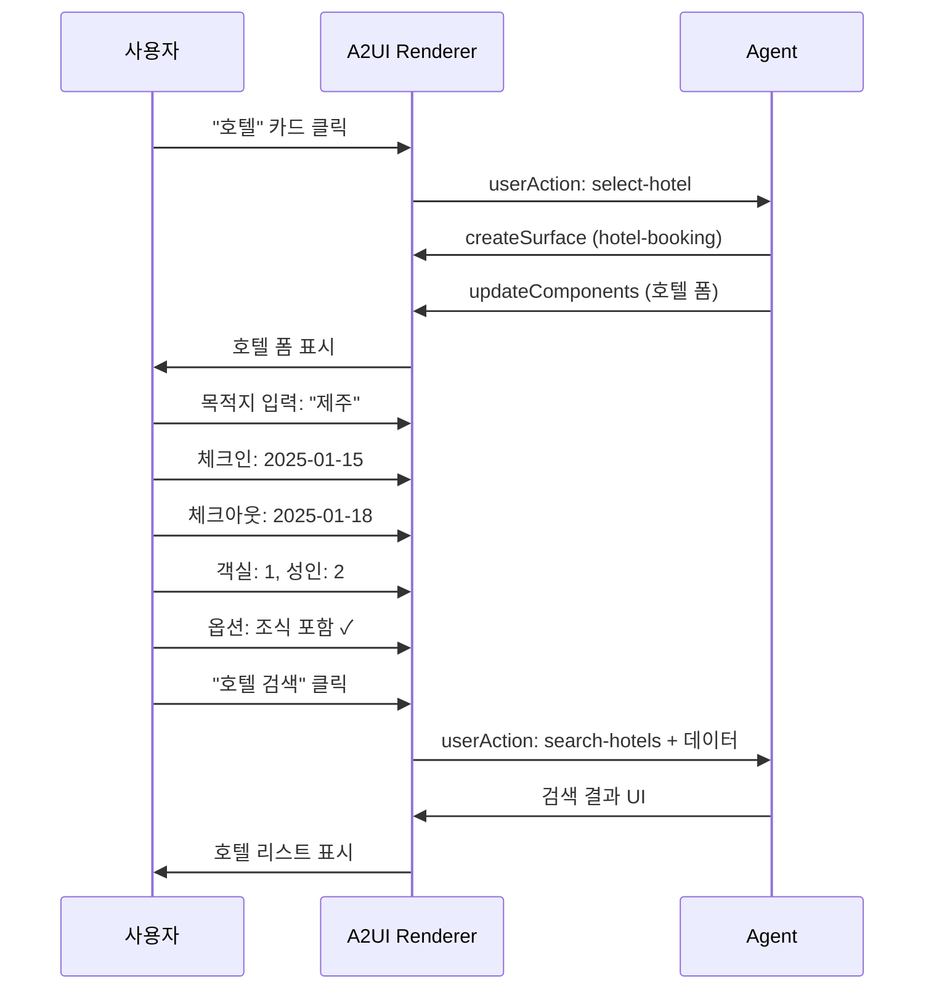
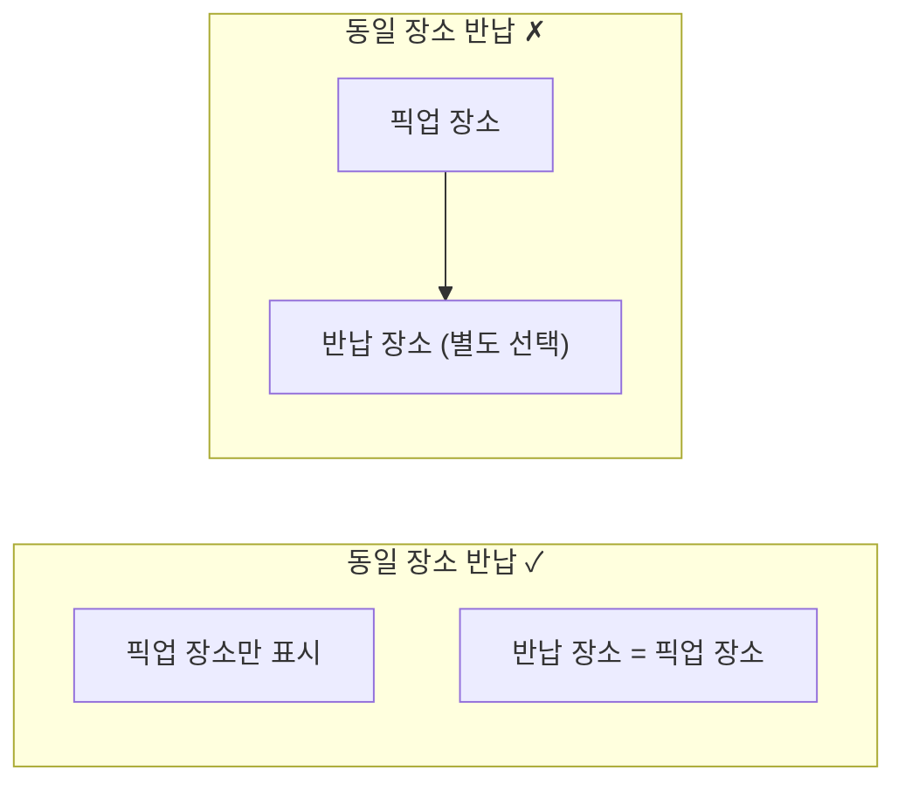
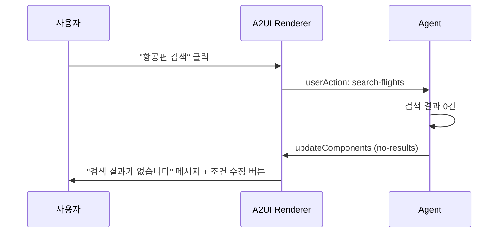

# 사용자 플로우

이 문서는 여행 예약 봇의 주요 사용자 시나리오를 정의합니다.

---

## 1. 전체 플로우 개요



---

## 2. 시나리오 1: 항공권 예약

### 2.1 시퀀스 다이어그램



### 2.2 단계별 상세

#### Step 1: 대화 시작

**사용자 입력:**
```
"제주도 여행 예약하고 싶어"
```

**Agent 의도 분석:**
- Intent: `travel_booking`
- Entity: `destination=제주도`

**Agent 응답:**
- 여행 타입 선택 UI 생성

---

#### Step 2: 여행 타입 선택

**화면:**
```
┌────────────────────────────────────────────────────┐
│  🤖 어떤 여행을 계획하고 계신가요?                  │
│                                                    │
│  ┌──────────┐ ┌──────────┐ ┌──────────┐ ┌────────┐│
│  │    ✈️    │ │    🏨    │ │    🚗    │ │   📦   ││
│  │  항공권  │ │   호텔   │ │  렌터카  │ │ 패키지 ││
│  └──────────┘ └──────────┘ └──────────┘ └────────┘│
└────────────────────────────────────────────────────┘
```

**사용자 액션:**
- "항공권" 카드 클릭

**userAction:**
```json
{
  "surfaceId": "travel-type-selector",
  "componentId": "flight-card",
  "action": "select-flight"
}
```

---

#### Step 3: 항공권 폼 입력

**화면:**
```
┌────────────────────────────────────────────────────┐
│  ✈️ 항공권 검색                                    │
│                                                    │
│  여행 유형                                         │
│  ● 왕복    ○ 편도                                  │
│                                                    │
│  출발지              도착지                        │
│  ┌────────────┐  ⇄  ┌────────────┐                │
│  │ 인천 (ICN)▼│     │ 제주 (CJU)▼│                │
│  └────────────┘     └────────────┘                │
│                                                    │
│  출발일                귀국일                      │
│  ┌────────────┐      ┌────────────┐               │
│  │ 2025-01-15 │      │ 2025-01-18 │               │
│  └────────────┘      └────────────┘               │
│                                                    │
│  탑승객                                            │
│  성인 [2]    아동 [0]    유아 [0]                  │
│                                                    │
│  좌석 등급: [이코노미 ▼]                           │
│                                                    │
│  [이전]              [항공편 검색]                 │
└────────────────────────────────────────────────────┘
```

**사용자 입력:**
1. 여행 유형: 왕복
2. 출발지: 인천 (ICN)
3. 도착지: 제주 (CJU)
4. 출발일: 2025-01-15
5. 귀국일: 2025-01-18
6. 성인: 2명
7. 좌석 등급: 이코노미

**"항공편 검색" 클릭 시 userAction:**
```json
{
  "surfaceId": "flight-booking",
  "componentId": "search-btn",
  "action": "search-flights",
  "data": {
    "flight": {
      "tripType": "roundtrip",
      "departure": "ICN",
      "arrival": "CJU",
      "departureDate": "2025-01-15",
      "returnDate": "2025-01-18",
      "passengers": { "adults": 2, "children": 0, "infants": 0 },
      "class": "economy"
    }
  }
}
```

---

#### Step 4: 검색 결과 표시

**화면:**
```
┌────────────────────────────────────────────────────┐
│  검색 결과 (3건)                                   │
│                                                    │
│  ┌──────────────────────────────────────────────┐ │
│  │ 대한항공 KE1201                               │ │
│  │ 08:00 ICN → 09:10 CJU                        │ │
│  │                           89,000원    [선택] │ │
│  └──────────────────────────────────────────────┘ │
│                                                    │
│  ┌──────────────────────────────────────────────┐ │
│  │ 아시아나 OZ8941                               │ │
│  │ 10:30 ICN → 11:40 CJU                        │ │
│  │                           95,000원    [선택] │ │
│  └──────────────────────────────────────────────┘ │
│                                                    │
│  ┌──────────────────────────────────────────────┐ │
│  │ 제주항공 7C101                                │ │
│  │ 14:00 GMP → 15:05 CJU                        │ │
│  │                           65,000원    [선택] │ │
│  └──────────────────────────────────────────────┘ │
│                                                    │
│  [검색 조건 수정]                                  │
└────────────────────────────────────────────────────┘
```

---

#### Step 5: 예약 완료

**화면:**
```
┌────────────────────────────────────────────────────┐
│                     ✅                             │
│                                                    │
│         예약이 완료되었습니다!                      │
│                                                    │
│  ┌──────────────────────────────────────────────┐ │
│  │ 예약번호: BK20250101-001                      │ │
│  │                                              │ │
│  │ 대한항공 KE1201                               │ │
│  │ 2025-01-15 (수) 08:00                        │ │
│  │ 인천 (ICN) → 제주 (CJU)                      │ │
│  │ 성인 2명 / 이코노미                           │ │
│  │                                              │ │
│  │ 총 결제금액: 178,000원                        │ │
│  └──────────────────────────────────────────────┘ │
│                                                    │
│  [처음으로]              [예약 상세]               │
└────────────────────────────────────────────────────┘
```

---

## 3. 시나리오 2: 왕복/편도 전환

### 3.1 조건부 UI 동작



### 3.2 사용자 액션 흐름

1. 초기 상태: 왕복 선택됨 → 귀국일 표시
2. 사용자가 "편도" 선택
3. 데이터 모델 업데이트: `/flight/tripType = "oneway"`
4. `return-date` 컴포넌트의 `visible` 조건 평가
5. 조건 `/flight/tripType == 'roundtrip'` → `false`
6. 귀국일 필드 숨김

---

## 4. 시나리오 3: 호텔 예약

### 4.1 시퀀스



### 4.2 호텔 폼 화면

```
┌────────────────────────────────────────────────────┐
│  🏨 호텔 검색                                      │
│                                                    │
│  목적지                                            │
│  ┌────────────────────────────────────────────┐   │
│  │ 🔍 제주                                     │   │
│  └────────────────────────────────────────────┘   │
│                                                    │
│  체크인                체크아웃                    │
│  ┌────────────┐      ┌────────────┐               │
│  │ 2025-01-15 │      │ 2025-01-18 │               │
│  └────────────┘      └────────────┘               │
│                                                    │
│  객실 수: [1]                                      │
│                                                    │
│  투숙객                                            │
│  성인 [2]              아동 [0]                    │
│                                                    │
│  옵션                                              │
│  ☑ 조식 포함                                       │
│  ☐ 무료 취소 가능                                  │
│  ☐ 반려동물 동반 가능                              │
│                                                    │
│  [이전]                [호텔 검색]                 │
└────────────────────────────────────────────────────┘
```

---

## 5. 시나리오 4: 렌터카 예약

### 5.1 조건부 UI: 동일 장소 반납



### 5.2 렌터카 폼 화면

```
┌────────────────────────────────────────────────────┐
│  🚗 렌터카 검색                                    │
│                                                    │
│  ☑ 동일 장소 반납                                  │
│                                                    │
│  픽업 장소                                         │
│  ┌────────────────────────────────────────────┐   │
│  │ 제주공항                                  ▼ │   │
│  └────────────────────────────────────────────┘   │
│                                                    │
│  픽업 일시              반납 일시                  │
│  ┌────────────┐      ┌────────────┐               │
│  │ 01-15 10:00│      │ 01-18 18:00│               │
│  └────────────┘      └────────────┘               │
│                                                    │
│  차종                                              │
│  ┌────────────────────────────────────────────┐   │
│  │ 중형                                     ▼ │   │
│  └────────────────────────────────────────────┘   │
│                                                    │
│  옵션                                              │
│  ☑ 완전 자차 보험                                  │
│  ☑ GPS 네비게이션                                  │
│  ☐ 유아용 카시트                                   │
│                                                    │
│  [이전]                [렌터카 검색]               │
└────────────────────────────────────────────────────┘
```

---

## 6. 에러 처리 플로우

### 6.1 검색 결과 없음



### 6.2 에러 메시지 UI

```
┌────────────────────────────────────────────────────┐
│                     ⚠️                             │
│                                                    │
│    검색 조건에 맞는 항공편이 없습니다.              │
│                                                    │
│    • 다른 날짜를 선택해보세요                       │
│    • 출발지/도착지를 변경해보세요                   │
│                                                    │
│              [검색 조건 수정]                       │
└────────────────────────────────────────────────────┘
```

---

## 7. 네비게이션 플로우

### 7.1 "이전" 버튼 동작

| 현재 화면 | "이전" 클릭 시 | 동작 |
|-----------|----------------|------|
| 항공권 폼 | 여행 타입 선택 | deleteSurface + createSurface |
| 호텔 폼 | 여행 타입 선택 | deleteSurface + createSurface |
| 검색 결과 | 해당 폼 | deleteSurface + createSurface |
| 예약 확인 | 검색 결과 | deleteSurface + createSurface |

### 7.2 "처음으로" 버튼 동작

모든 Surface 삭제 후 여행 타입 선택 UI로 복귀

```json
{
  "userAction": {
    "surfaceId": "booking-confirmation",
    "componentId": "home-btn",
    "action": "go-home"
  }
}
```
